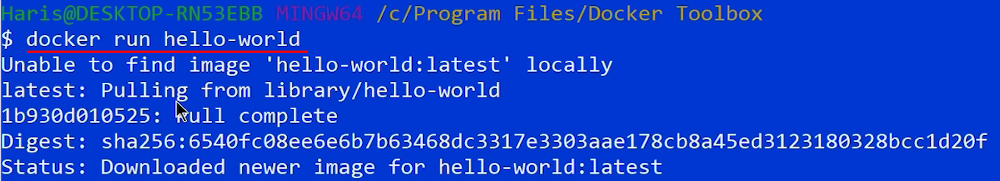
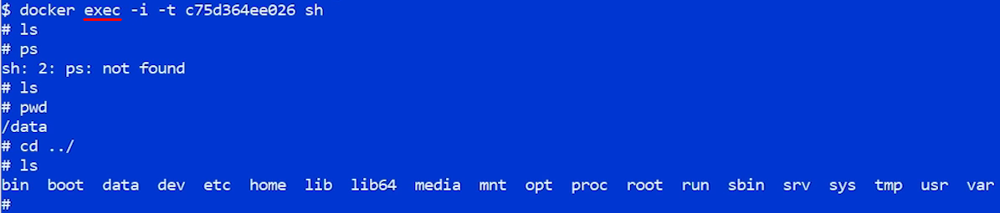
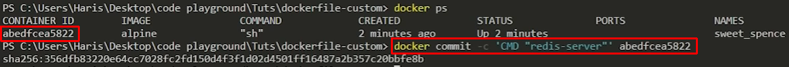

# Docker Setup

Maker sure that virtualization is enabled on your machine.

Download VirtualBox. Windows 10 Home Edition requires VirtualBox.
Windows 10 Professional does not.

<https://www.virtualbox.org/wiki/Downloads>

Download Docker Toolbox for Windows 10 Home.

Launch docker from desktop shortcut & try below commands.

**\$docker version**

**\$docker run hello-world**

Downloads the hello-world image only first time if not available
locally.

**\$docker run redis**

Changing start-up command – Above example runs default command that
comes with image.

`Ctrl+C` to exit from above command.

Display currently active containers. They need to be stopped explicitly.
Hello-world just displays the message & exits, hence it is not visible
in below list.

To display all containers including the exit ones –

**\$docker stop \<CONTAINER ID\>** 🡨 to stop the specific container

Validate that the contains is stopped by command docker ps.

**-a** option is used to attach CLI to container so that the output is
redirected to CLI.

To see inside the running container –

**\$docker kill \<ID\>** 🡨to forcefully kill the container when the
container is not responding

To see inside the running container using the container shell –

`Ctrl+D` to exit from the shell of container. **-i** (interactive) to pass
input to container shell from CLI. **-t** (terminal) is for formatting
the output of container shell. You can combine them as **-it**
(interactive terminal).

**Dockerfile** – text file used for building your own custom image from
other existing image.

Create Dockerfile & add commands & build the docker with command docker
build .

Once build completes, run the docker.

Every step modifies file system snapshot & removes intermediate
container & takes snapshot of new file system.

Commit the docker & set the start-up command –

Run the docker with partial string –

