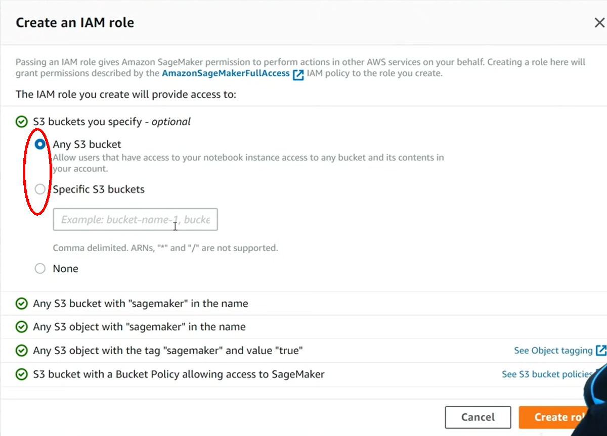
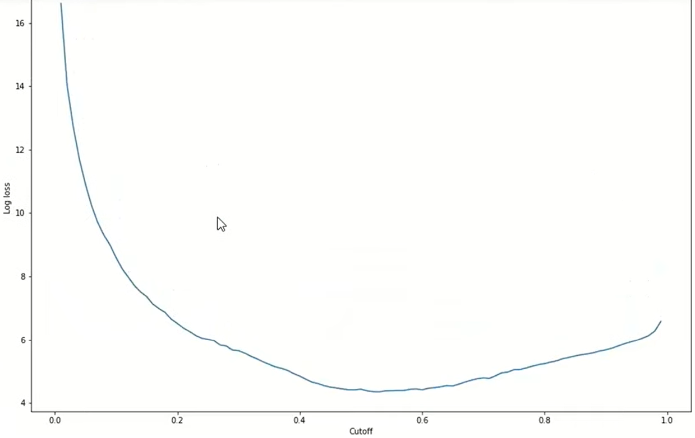

**Amazon SageMaker**

Basic mlops flow-

Amazon SageMaker provides below services-

SageMaker allows us to run the different containers on ML-optimized
instances.

The automation tools in AWS **SageMaker Studio** help users to
automatically debug, manage and track ML models. These SageMaker tools
include the following:

**Autopilot** enables AI models to be trained for a given data set and
ranks each algorithm by accuracy. No need to explicitly specify the
model.

**Clarify** flags potential bias that could skew ML models.

**Data Wrangler** is used to speed up data preparation.

**Debugger** monitors the metrics of neural networks to simplify the
debugging process.

**Edge Manager** extends ML monitoring and management to edge devices.

**Experiments** makes it easier to track different ML iterations,
including how changes degrade or improve a model's accuracy.

**Ground Truth** speeds up data labeling and helps to lower labeling
costs when processing large AI training samples. You can label Image,
Text, Video or Custom.

Image: Suported Tasks

**JumpStart** offers a set of customizable, predesigned AWS
CloudFormation templates.

**Model Monitor** is an AWS-enabled ML tool to spot application-level
deviations that negatively affect the accuracy of predictions.

**Notebook** creates Jupyter notebooks with one click and transfers the
content of a notebook for collaborative use.

You can reuse SageMaker Examples. Just click on Use to create copy of
example notebook. AWS SageMaker Examples GitHub Repository -
<https://github.com/aws/amazon-sagemaker-examples>

**Pipelines** offer developers ML services for continuous delivery and
continuous integration.

**AWS Marketplace** find & buy readily available trained model developed
by third party vendors, a B2B marketplace.

  
**Training** creates training job on data specified by S3 bucket & place
trained model back in S3 bucket. You can leverage built-in algorithms or
BYO or get once from Marketplace.

Endpoint puts trained model on CPU/GPU to make predictions. You need to
create endpoint before deploying the model to SageMaker.

**Augmented AI ???**

**Lambda** FaaS i.e. serverless computing, upload a code & choose an
event when that code should run. Pay for the exact computing time you
use. For our MLOps pipeline, Lambda functions can be efficiently
leveraged to trigger the different SageMaker jobs (e.g. Train, Evaluate,
Deploy…), perform additional operations if necessary, and pass
parameters (variables passed via CodePipeline) from one step to another
within the pipeline.

**Ec2** (Elastic Compute Cloud) a virtual server, it is like a virtual
computer in cloud, choose OS Memory & computing power & rent that space
in cloud like renting an apartment.

**Docker** containers allows model to run on multiple clouds or
computing environments.

**S3** (Simple Storage Service) stores any type of files. It is nothing
but a simple folder which holds files.

<u>Writing & listing train & validation datasets to S3 bucket-</u>

**IAM** (Identity & Access Management) – creates roles & decides who has
access to what. You can create role which have access to all or specific
S3 bucket.

<u>Getting Role & Region-</u>

**CodeBuild** (CI) allows us to build a dedicated Docker image
(environment that contains all of the necessary packages) for each step
of the pipeline e.g. Train, Valuate, Deploy.

**CodePipeline** (CD) the bigger picture. Defines/build the actual
pipeline. The pipeline can be triggered based on some instance(depending
on how frequently you want the pipeline to run). CodePipeline also
offers connectors to most source control services to pull latest
codebase.

**<u>How to Launch SageMaker?</u>**

Login to AWS & go to services from top menu.

**<u>Using inbuilt XGBOOST model in SageMaker-</u>**

Setting the hyper parameters-

Format the csv dataset into acceptable to SageMaker and fit to model-

To view debugger training reports-

Download the training & profiling reports to current workspace-

To get XGBOOST training report path-

To get the link of profile report file-

Deploying the model-

Path of saved model-

Deploy
by specifying the EC2 instance type-

Endpoint name-

Evaluate the model from the endpoint created-

Confusion Matrix

Compute log-loss function for logistic regression

Reference - <https://www.youtube.com/watch?v=6cg5ERPQ2v8>

**AWS Lambda**

AWS Lambda is a serverless compute service.

